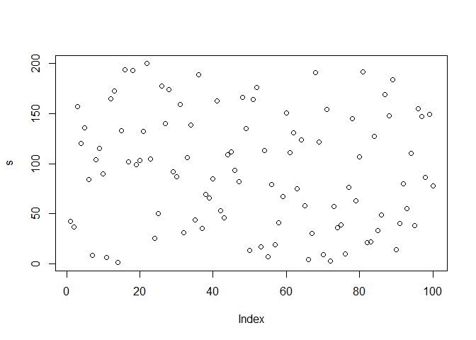
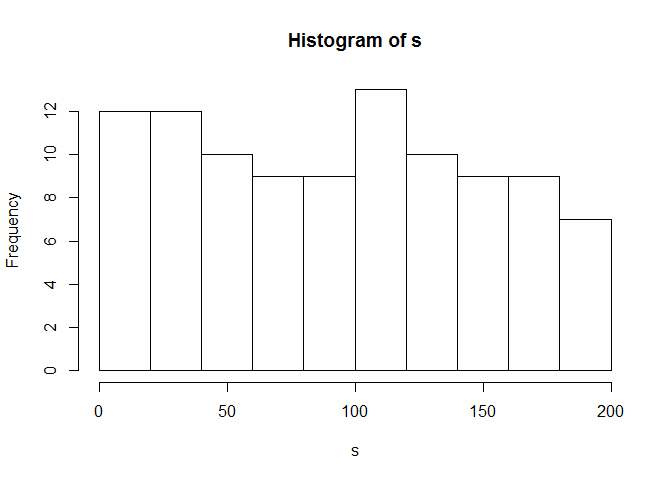
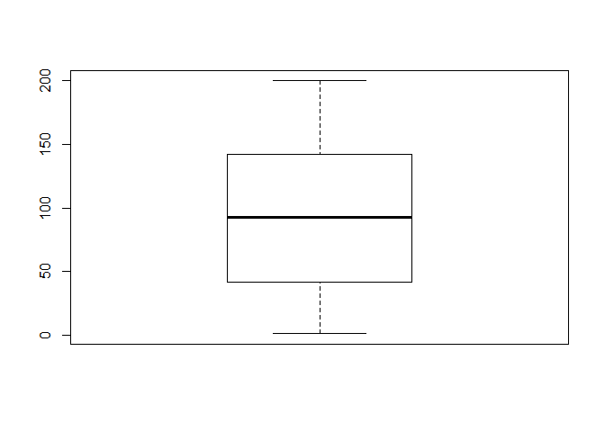

R Markdown
----------

This is an R Markdown document. Markdown is a simple formatting syntax
for authoring HTML, PDF, and MS Word documents. For more details on
using R Markdown see <http://rmarkdown.rstudio.com>.

When you click the **Knit** button a document will be generated that
includes both content as well as the output of any embedded R code
chunks within the document. You can embed an R code chunk like this:

    summary(cars)

    ##      speed           dist       
    ##  Min.   : 4.0   Min.   :  2.00  
    ##  1st Qu.:12.0   1st Qu.: 26.00  
    ##  Median :15.0   Median : 36.00  
    ##  Mean   :15.4   Mean   : 42.98  
    ##  3rd Qu.:19.0   3rd Qu.: 56.00  
    ##  Max.   :25.0   Max.   :120.00

    #Creating a sample Vector
    s  <- sample(1:200,100)
    s

    ##   [1]  42  37 157 120 136  84   8 104 115  90   6 165 173   1 133 194 102
    ##  [18] 193  99 103 132 200 105  25  50 178 140 174  92  87 159  31 106 139
    ##  [35]  44 189  35  69  66  85 163  53  46 109 112  93  82 166 135  13 164
    ##  [52] 176  17 113   7  79  19  41  67 151 111 131  75 124  58   4  30 191
    ##  [69] 122   9 154   3  57  36  39  10  76 145  63 107 192  21  22 127  33
    ##  [86]  49 169 148 184  14  40  80  55 110  38 155 147  86 149  78

    #Plotting a Scatter diagram
    plot(s)

Plotting a Histogram
====================

    hist(s)

Plotting a Box plot
===================

    boxplot(s)

